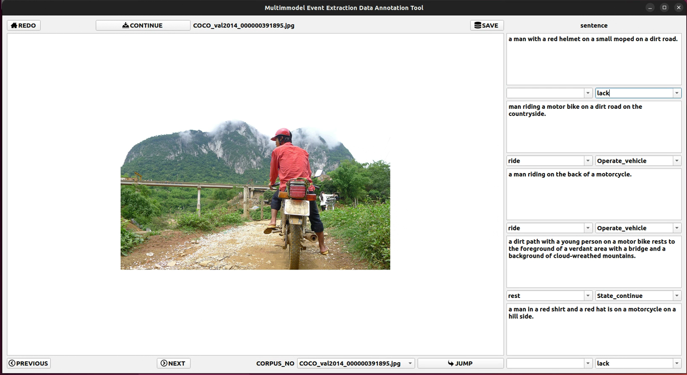

# A data labeling check tool generated from an event

## Background：

This tool acts on the coco2014 dataset based on multimodal datasets based on human activities for human evaluation of verb-generated events

## install:

The graphical interface of this function is mainly based on pyqt

## Usage：

### set database

set the events path of database 

### run 

run the main.py

